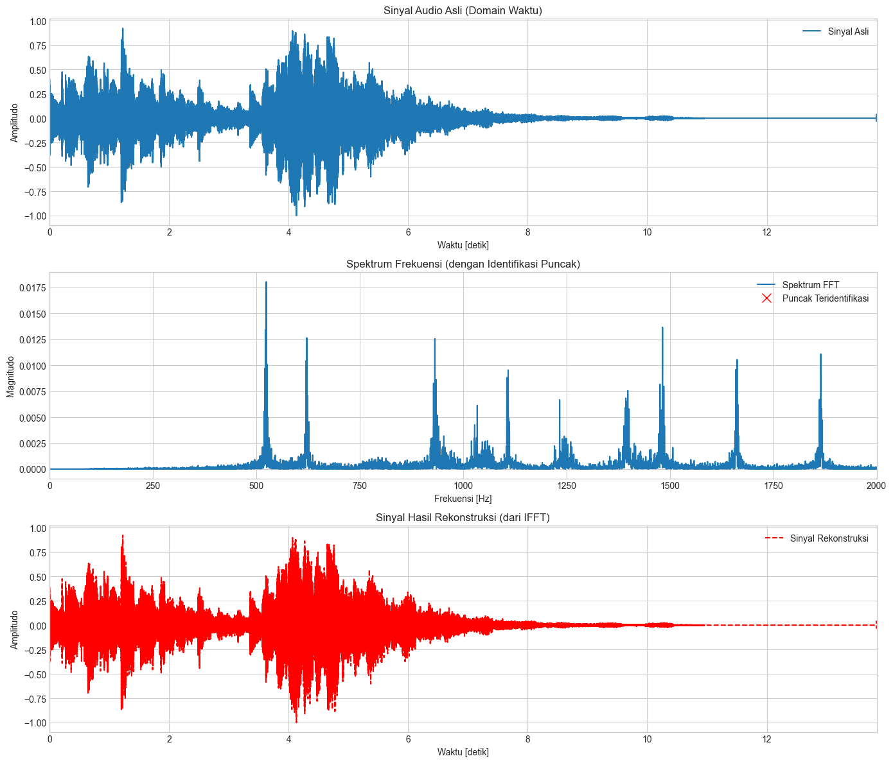

# Analisis Sinyal Musik: Transformasi Fourier (FFT & IFFT)

<p align="center">
  
  
  
  
</p>

Proyek ini adalah implementasi tugas mata kuliah Pemrosesan Sinyal Digital. Tujuannya adalah untuk menganalisis sebuah klip musik dengan mengubah sinyal dari domain waktu ke domain frekuensi menggunakan **FFT (Fast Fourier Transform)**, mengidentifikasi frekuensi-frekuensi penting, dan merekonstruksinya kembali ke domain waktu dengan **IFFT (Inverse Fast Fourier Transform)**.

---

## 📊 Visualisasi Hasil

Berikut adalah visualisasi komparatif dari sinyal asli, spektrum frekuensi yang dianalisis, dan sinyal hasil rekonstruksi.



*Gambar di atas menunjukkan bahwa sinyal hasil rekonstruksi (dari IFFT) identik dengan sinyal audio asli, membuktikan akurasi proses transformasi.*

---

## ✨ Fitur Utama

- **Pemuatan Sinyal**: Memuat file audio `.wav` dan melakukan normalisasi amplitudo.
- **Analisis Spektrum**: Menerapkan FFT untuk menguraikan komponen frekuensi sinyal.
- **Identifikasi Puncak**: Menggunakan `scipy.signal.find_peaks` untuk mendeteksi frekuensi fundamental dan harmonik secara otomatis.
- **Rekonstruksi Akurat**: Menggunakan IFFT untuk mengembalikan spektrum frekuensi menjadi sinyal waktu.
- **Validasi Numerik**: Menghitung *mean absolute error* untuk memvalidasi bahwa selisih antara sinyal asli dan rekonstruksi mendekati nol.

---

## 🛠️ Instalasi & Cara Menjalankan

Untuk menjalankan notebook ini di komputer Anda, ikuti langkah-langkah berikut:

1.  **Clone repository ini:**
    ```bash
    git clone https://github.com/Mystery-World3/Music-Signal-Analysis-FFT.git
    cd Music-Signal-Analysis-FFT
    ```

2.  **Pastikan Anda memiliki pustaka yang dibutuhkan.** Jika belum, instal melalui pip:
    ```bash
    pip install numpy scipy matplotlib
    ```

3.  Letakkan file audio yang ingin dianalisis dengan nama `sound.wav` di dalam direktori utama.

4.  Buka dan jalankan file `Transformasi Frekuensi.ipynb` melalui Jupyter Notebook atau Jupyter Lab.

---


*Created by Mystery-World3*

